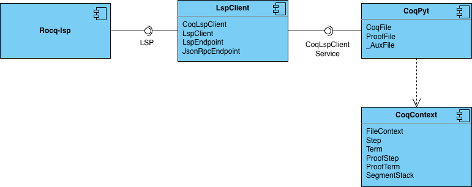

# Documentation

This document covers the basic breakdown of the CoqPyt system, allowing for the easier use and contribution to this project. The following will be provided to achieve this goal: 
- A breakdown of the CoqPyt's package structure,
- A breakdown of the components that allow CoqPyt to carry out its function,
- Class diagrams showing the structures found in each package and how they relate to each other,
- Explanations for the most notable classes in each package, and
- Sequence diagrams demonstrating how some notable operations work under the hood.

## Table of Contents
- [Components and Packages](#components-and-packages)
- [Class Implementations](#class-implementations)
    - [`lsp` Package](#lsp-package)
    - [`coq::lsp` Package](#coqlsp-package)
    - [`coq` Package](#coq-package)
- [Sequence Diagrams](#sequence-diagrams)
    - [`CoqFile.__init__()`](#coqfile__init__)
    - [`CoqFile.exec()`](#coqfileexec)
    - [`CoqFile.add_step()`](#coqfileadd_step)
    - [`CoqFile.change_steps()`](#coqfilechange_steps)
    - [`CoqFile.save_vo()](#coqfilesave_vo)

## Components and Packages

With how CoqPyt is designed, the system could be broken down into 4 components, the Rocq LSP itself, the LSP Client, the Rocq Context, and finally the base of CoqPyt itself. This is not how the system is structured in the source code, however it can be helpful to view it this way for better understanding.

The `Rocq-lsp` component is a refence to the Rocq Language Server that runs separately on the machine. This component offers its service through the LSP, allowing other processes, such as VSCode and CoqPyt to analyze and modify Rocq files. The exact implementation of this component is not a concern of this system, however the interface of the LSP is. Details on the exact protocol used by the LSP can be found from [Microsoft](https://microsoft.github.io/language-server-protocol/specifications/lsp/3.17/specification/) and the [Rocq Community](https://github.com/rocq-community/rocq-lsp/blob/main/etc/doc/PROTOCOL.md).

The `LspClient` component is the implementation of a client that can be used to communicate with the LSP. This component contains both the default implementation of an LSP client as specified by the [LSP Specifications](https://microsoft.github.io/language-server-protocol/specifications/lsp/3.17/specification/) and a more specialized implementation for the Rocq LSP as specified by [Rocq LSP Protocol](https://github.com/rocq-community/rocq-lsp/blob/main/etc/doc/PROTOCOL.md). Through the use of a JSON RPC endpoint, this component is able to communicate with the LSP and provide an LSP Client service to be used by the rest of CoqPyt.

The `CoqContext` component is a collection of classes that abstract over the elements that can be found in Rocq file. Terms and steps are structures that represent the definitions of variables and notations and the tactics that are used in these definitions. The proof variants of these include extra information that is specific to the goal driven nature of Rocq proofs. `FileContext` is the main class used to manage these definitions through the processing of steps in the AST of the Rocq file.

The `CoqPyt` component is the main interface that is open for the user to interact with. Both `CoqFile` and `ProofFile` provide operations for navigation through and modifying Rocq files. 

As a framework intended to communicate with the Rocq LSP, proper interfaces must be put in place to assist with this communication. To do so, the CoqPyt source code is broken down into 3 packages, as shown below.

The external `lsp` package contains a basic implementation of JSON RPC based LSP client. The `coq` package contains all classes that are directly related to CoqPyt, such as the `CoqFile` class and `FileContext` class. With in the `coq` package, the internal `lsp` package contains a specialized instance of an LSP client for Rocq. More information of how each of these packages carry out their tasks can be found below.

## Class Implementations

### `lsp` Package

The `lsp` package defines the many structures used by LSPs as defined in the LSP Specifications and provides implementations for interfaces to communicate with an LSP. Notable classes in this package include [`Range`](./coqpyt/lsp/structs/Range.md), [`Diagnostic`](./coqpyt/lsp/structs/Diagnostic.md), [`JsonRpcEndpoint`](./coqpyt/lsp/json_rpc_endpoint/JsonRpcEndpoint.md), [`LspEndpoint`](./coqpyt/lsp/endpoint/LspEndpoint.md), and [`LspClient`](./coqpyt/lsp/client/LspClient.md). 

#### `Range`
Since language servers handle text files, having a way to specify a group of characters in these files is important. The `Range` class allows for the refencing of a string between two positions in a file. This class use used frequently throughout CoqPyt to assist in the modification of the files. 

#### `Diagnostic`
The `Diagnostic` class represents hints, warnings, or errors that could be created when evaluating a file. CoqPyt keeps track of all diagnostics for the ease of knowing how a specific step impacts the execution of a file. CoqPyt also uses diagnostics as a way to locate terms and notations in a file, since they can provide hints on definitions and other requirements.

#### `JsonRpcEndpoint`
Because LSPs are built on top of the JSON RPC protocol, CoqPyt creates an abstraction for sending messages using this protocol. Through the operations `send_request` and `recv_response`, the exact implementation details for sending and receiving the JSON messages is hidden from the client. Messages are passed using the `stdin` and `stdout` buffers of the Rocq LSP process with the contents in the form of stringified JSON.

#### `LspEndpoint`
On top of the JSON RPC endpoint, the `LspEndpoint` provides interfaces for the sending and receiving of LSP specific messages. LSPs can pass 3 types of messages, unidirectional messages/notifications, method calls, and responses. Method calls are unique in that they await a response from the other process. This class provides a way for messages to be sent such that the thread of execution is blocked until a response is received.

With the asynchronous requirements of inter-process communication, the LSP client must be able to listen for messages at any given time. The `LspEndpoint` defines a procedure that runs on a separate thread awaiting messages from the `JsonRpcEnpoint`. Upon receival, the endpoint can run call back methods or resume waiting method calls.

Lastly, the `LspEndpoint` holds all diagnostics that are submitted by the language server. The endpoint is designed to capture all `"textDocument/publishDiagnostics"` notifications and store the diagnostics for retrieval by CoqPyt at a later point in time.

#### `LspClient`
Through the `LspEndpoint`, the `LspClient` provides the final abstraction of communicating with a language server. This class defines high level operations that can be run by CoqPyt and the user to do everything from initializing the language server, managing open files, and retrieving definition information. This class allows the user to focus only on what information they want to send and receive without having to think about how they need to accomplish their goal.

### `coq::lsp` Package

The `coq::lsp` package defines additional structures used only by the Rocq LSP to create a specialization on top of the basic `LspClient`. Notable classes in this package include [`FlecheDocument`](./coqpyt/coq/lsp/structs/FlecheDocument.md), [`GoalAnswer`](./coqpyt/coq/lsp/structs/GoalAnswer.md), and [`CoqLspClient`](./coqpyt/coq/lsp/client/CoqLspClient.md).

#### `FlecheDocument`
In order to represent the parse tree for a file, the Rocq LSP use the Fleche document format to define an AST. Once retrieved from the LSP, the Fleche document holds two attributes, an AST of the file and a status object for how far the AST reaches in the file. Each element in the AST is represented using a `RangedSpan` object which holds the element itself the location of the element in the file. Each element in this AST is in the format of a Vernacular expression. The details of the format of these expressions can be found in the Rocq Prover documentation in the [Vernacexpr package](https://rocq-prover.org/doc/v8.20/api/coq-core/Vernacexpr/index.html). 

#### `GoalAnswer`
One specialization the Rocq LSP offers is a way to retrieve the proof goals of a file. In Rocq, each proof contains a set of goals that represent the things the proof is meant to achieve. `GoalConfig` represents the entire collection of goals of a proof while the `GoalAnswer` object pinpoints how one step taken in a proof can affect these goals. This object allows for the observation of the progress of proofs and can give hints on possible next steps that should be taken based on what goals have or have not been satisfied.

#### `CoqLspClient`
In order to abstract away the specific method calls required to retrieve Rocq specific objects, CoqPyt defines the `CoqLspClient`. This class inherits all the previous methods of the `LspClient` class, but defines 3 new methods: `get_document`, `proof_goals`, and `save_vo`. The usage of the first two correspond to the 2 classes explained above, while the last allows for the requesting the Rocq LSP to compile the specified file.

### `coq` Package

The `coq` package defines all of the parts of the system that are directly related to CoqPyt and its goals. This package provides the direct interfaces that are used by the user in navigating and modifying Rocq files. Notable classes in this package include [`Step`](./coqpyt/coq/structs/Step.md), [`Term`](./coqpyt/coq/structs/Term.md), [`FileContext`](./coqpyt/coq/context/FileContext.md), [`_AuxFile`](./coqpyt/coq/proof_file/_AuxFile.md), [`CoqFile`](./coqpyt/coq/base_file/CoqFile.md), and [`ProofFile`](./coqpyt/coq/proof_file/ProofFile.md).

#### `Step`
A `Step` represents a single expression found in a Rocq file. This object holds the text of the expression, the element in the AST it is associated with, and all related diagnostics. When a file is opened by CoqPyt, it automatically creates steps for every expression in the file. These steps are then what is used as the smallest unit of the navigation in the file. On top of `Step`, CoqPyt also defines `ProofStep` which represents a step, or tactic, that is taken with in a proof.

#### `Term`
A `Term` represents a definition within the file. The  different types a term can represent can be found under the [TermType](./coqpyt/coq/structs/TermType.md) enum. Each term holds the `Step` in which it was defined. Unlike `Steps`, `Terms` are only created once the execution of the file reaches their definition, where they will then be added to the context of the file under the module they are defined in. On top of `Term`, CoqPyt also defines `ProofTerm` which is a special type of `Term` to represent a proof as a whole. These contain all steps used in the proof along with the terms defined in it.

#### `FileContext`
The `FileContext` is how CoqPyt handles the terms defined in both the current file and any libraries. The context stores all of the terms according to the modules they are defined in through the help of the `SegmentStack`, which keeps track of where the current location of execution is in the module tree. Terms can be added to and removed from the context through the processing of a step or through adding and removing libraries. The `FileContext` also offers operations for identifying what effects a step may have on the execution of a file, such as whether a step defines a new proof. 

#### `_AuxFile`
While the operations offered by the Rocq LSP are sufficient in completing most tasks, there are a few cases where direct method calls cannot complete the required task. `_AuxFile` is a special interface created by CoqPyt that allows for communicating with the LSP by writing directly in files the LSP evaluates. The importing of libraries and searching for notations are two of the tasks this class assists with. 

Without a defined method call to get all libraries used in a file, CoqPyt uses the `Print Libraries.` command to force the LSP to create a diagnostic containing the list of libraries. From there, CoqPyt can open the file and retrieve the context defined in the file. Due to the demand of accessing libraries, CoqPyt allows for the caching of files on the disk. The implementation for caching is defined within `_AuxFile` as well.

Because defining special notations is a unique part of Rocq, CoqPyt must find a different way of locating the definitions for the notations. CoqPyt uses the `_AuxFile` then to run the `Location {notation}.` command to force a diagnostic about the current notation. From there, the term that is notation references can be retrieved for the user.

#### `CoqFile`
`CoqFile` is the main class that is used within the users python script to interact with CoqPyt. This object contains all of the information needed in running the LSP, handling the context, handling navigation, and adding or removing steps. This object also handles reading the file's contents and the writing of changes made to it. More information of the specifics of how many of the important operations of `CoqFile` are defined, see the [Sequence Diagrams](#sequence-diagrams).

#### `ProofFile`
`ProofFile` is a specialization of `CoqFile` that adds more operations that are useful in analyzing proofs. One of the extra tasks it carries out during execution is keeping track of proofs and proof goals. If the current step of execution is in the middle of a proof, the `current_goals` property can be used to get all of the goals for the current proof. 

Another useful set of operations `ProofFile` offers is  `append_step` and `pop_step`. These operations allow the user to treat the proof like a stack steps, making the testing of different tactics much easier, since the user is not required to specify the location at which to add and remove steps.

## Sequence Diagrams

Below are a collection of some key operations that are offered by CoqPyt through the `CoqFile` class. The `ProofFile` operations are very similar to the related `CoqFile` operations with a few extra calls for converting terms and steps into their proof equivalents.

#### `CoqFile.__init__()`

As the main interface of the system, the `CoqFile` must be able to initialize all aspects of the system. When creating a new `CoqFile`, a file path to the Rocq file must be passed in. First, the `__init_path` method is called which handles the case of the path pointing to an unmodifiable Rocq file, such as a library. From there, the `CoqLspClient` and its related objects are created and initialized. Then, the `CoqFile` sends the `"textDocument/didOpen"` notification to the LSP through `CoqLspCient` to have the server open and evaluate the file. With the file evaluated, the `CoqFile` calls the `"coq/getDocument"` method to get the [FlecheDocument](./coqpyt/coq/lsp/structs/FlecheDocument.md) with the AST from the server. Using the AST, the `CoqFile` initializes all steps in a loop. Finally, the `CoqFile` creates a new `FileContext` instance for storing terms. This `FileContext` finishes its initialization through the creation of a new `SegmentStack` instance.

#### `CoqFile.exec()`

The `exec()` operation is used to execute a provided number of steps in a Rocq file. This number of steps could be negative to indicate that the steps should be undone instead. After being called, the `CoqFile` runs the `_step()` method the indicated number of times. In this method, the `CoqFile` could take two paths of execution. If the number of steps is positive, then the `CoqFile` calls the `process_step()` method on the `FileContext` object which handles adding all terms that are defined from this step. If the number of steps is negative, then the `CoqFile` calls the `undo_step()` method on the `FileContext` object which removes any terms that were defined from this step.

#### `CoqFile.add_step()`

As an example of making a specific change to a file, the execution of the `add_step()` method is used. When calling the `add_step()` method, the `CoqFile` calls the `_make_change()` method.  From here, the `CoqFile` performs the necessary changes to the file through adding the text to the file, calling the `CoqLspClient` to re-evaluate the file, then retrieving the updated AST from the LSP. With the updated AST, the `CoqFile` re-initializes all steps, then runs `exec()` to ensure that the context of the file has been updated to match the changes.

The operation for removing steps is very similar, with minor differences in calling the corresponding remove operations instead.

#### `CoqFile.change_steps()`

While the simple operation of adding or removing one step can be useful, the real power of CoqPyt's file modification is through the `change_steps()` operation. This method takes in a list of `CoqChange` objects which represent individual changes to the file, such as addition and deletion. What makes this operation so powerful is its ability to roll back the file after modification. To accomplish this, under the `_make_change()` method, it calls `__set_backup_steps()` which stores a copy of the current steps of the file into a separate attribute. Then, it calls `_change_steps()` to apply the provided changes. After moving the point of execution to before the location of the changes, `CoqFile` goes through each change and applies the proper adjustments to the file's contents and to the AST. Next, it calls the `__update_steps()` method to retrieve the updated AST from the LSP. If the new AST is not valid, then the execution of the method breaks without calling the `__copy_steps()` which actually applies the changes. Finally, `exec()` is ran to ensure that the context of the file has been updated to match the changes.

By never applying invalid changes to the file, it allows the user to be able to test changes to the file without consequences. This is extremely useful in proofs, where one may want to try multiple difference tactics, but are unsure if the changes will be successful.

#### `CoqFile.save_vo()`

The `save_vo()` method is a simple method that communicates with the `CoqLspClient` by calling the `"coq/saveVo"` method. This example is mainly useful in seeing how the `CoqFile` uses the `CoqLspClient` to communicate in isolation.
